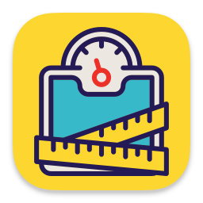
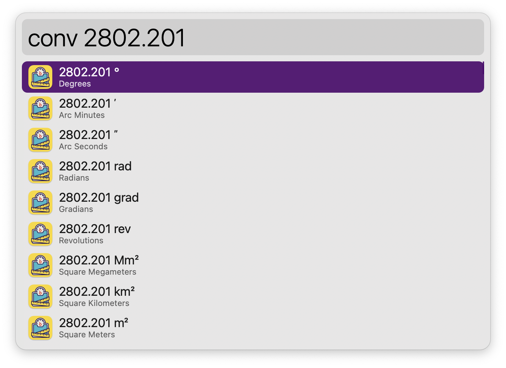
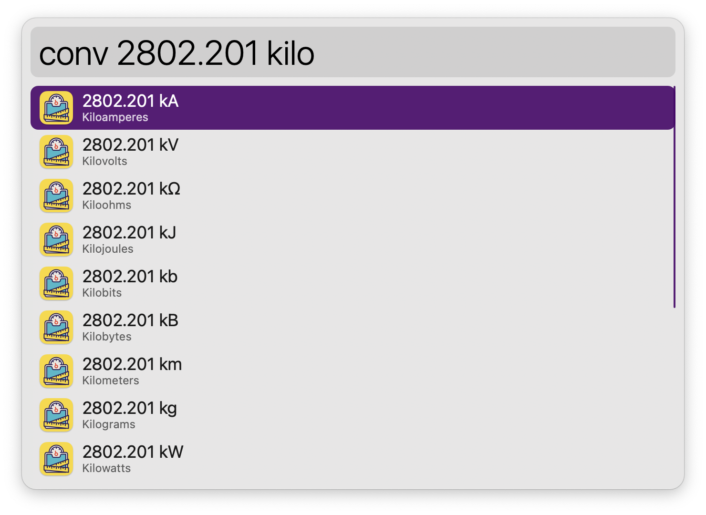
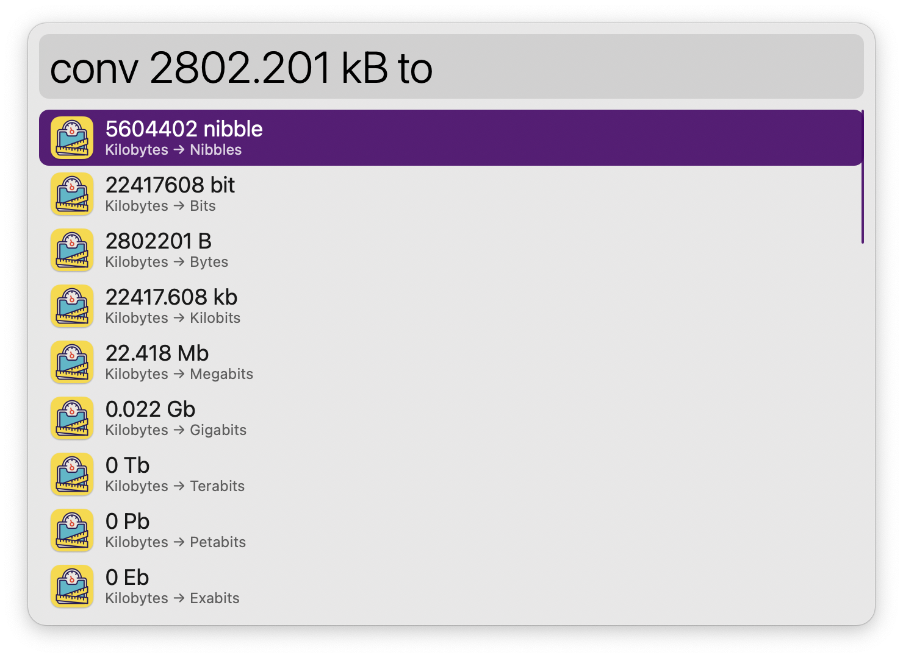
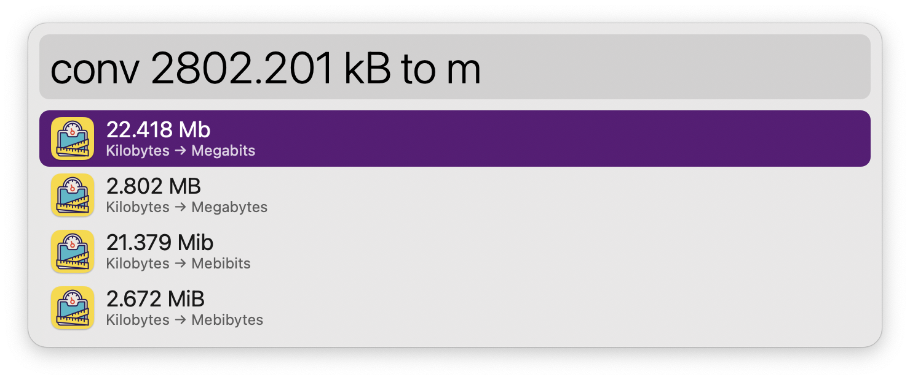
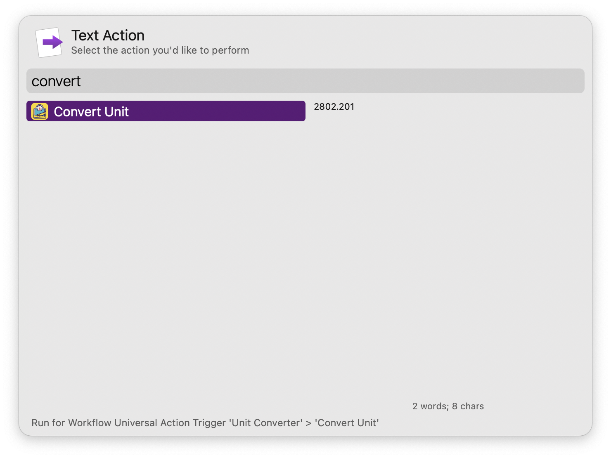

#  Unit Converter Alfred Workflow

Convert between different units of measurement

[⤓ Install on the Alfred Gallery](https://alfred.app/workflows/alfredapp/unit-converter-workflow)

## Usage

Convert dimensions via the `conv` keyword. Type a number to see all available units with their full name and symbol.

Type a unit to filter.

Pressing <kbd>↩&#xFE0E;</kbd> on a partial match triggers the autocomplete. See all possible conversion targets when matching a unit exactly.

Type further to filter for target units. Connector words (“to”, “as”, “in”) are optional to help with readability. Rounding precision can be set in the [Workflow’s Configuration](https://www.alfredapp.com/help/workflows/user-configuration/).

* <kbd>↩&#xFE0E;</kbd>: Copy result to clipboard.
* <kbd>⌘</kbd><kbd>↩&#xFE0E;</kbd>: Paste result to frontmost app.

Configure the [Hotkey](https://www.alfredapp.com/help/workflows/triggers/hotkey/) or use the [Universal Action](https://www.alfredapp.com/help/features/universal-actions/) as shortcuts to convert results from Alfred’s [Calculator](https://www.alfredapp.com/help/features/calculator/), [Clipboard History](https://www.alfredapp.com/help/features/clipboard/), or selected text.

### Supported Units

#### Angle

* degrees, °
* arc minutes, ʹ
* arc seconds, ʺ
* radians, rad
* gradians, grad
* revolutions, rev

#### Area

* square megameters, Mm²
* square kilometers, km²
* square meters, m²
* square centimeters, cm²
* square millimiters, mm²
* square micrometers, µm²
* square nanometers, nm²
* square inches, in²
* square feet, ft²
* square yards, yd²
* square miles, mi²
* acres, ac
* ares, a
* hectares, ha

#### Concentration of Mass

* grams per liter, g/L
* milligrams per deciliter, mg/dL

#### Duration

* seconds, s
* minutes, min
* hours, hr

#### Electric Charge

* coulombs, C
* megaampere hours, MAh
* kiloampere hours, kAh
* ampere hours, Ah
* milliampere hours, mAh
* microampere hours, µAh

#### Electric Current

* megaamperes, MA
* kiloamperes, kA
* amperes, A
* milliamperes, mA
* microamperes, µA

#### Electric Potential Difference

* megavolts, MV
* kilovolts, kV
* volts, V
* millivolts, mV
* microvolts, µV

#### Electric Resistance

* megaohms, MΩ
* kiloohms, kΩ
* ohms, Ω
* milliohms, mΩ
* microohms, µΩ

#### Energy

* kilojoules, kJ
* joules, J
* kilocalories, kCal
* calories, cal
* kilowatt hours, kWh

#### Frequency

* terahertz, THz
* gigahertz, GHz
* megahertz, MHz
* kilohertz, kHz
* hertz, Hz
* millihertz, mHz
* microhertz, µHz
* nanohertz, nHz

#### Fuel Efficiency

* liters per 100 kilometers, L/100km
* miles per gallon, mpg
* miles per imperial gallon, imperial mpg

#### Information Storage

* nibbles, nibble
* bits, bit
* bytes, B
* kilobits, kb
* megabits, Mb
* gigabits, Gb
* terabits, Tb
* petabits, Pb
* exabits, Eb
* zettabits, Zb
* yottabits, Yb
* kibibits, Kib
* mebibits, Mib
* gibibits, Gib
* tebibits, Tib
* pebibits, Pib
* exbibits, Eib
* zebibits, Zib
* yobibits, Yib
* kilobytes, kB
* megabytes, MB
* gigabytes, GB
* terabytes, TB
* petabytes, PB
* exabytes, EB
* zettabytes, ZB
* yottabytes, YB
* kibibytes, KiB
* mebibytes, MiB
* gibibytes, GiB
* tebibytes, TiB
* pebibytes, PiB
* exbibytes, EiB
* zebibytes, ZiB
* yobibytes, YiB

#### Length

* megameters, Mm
* kilometers, km
* hectometers, hm
* decameters, dam
* meters, m
* decimeters, dm
* centimeters, cm
* millimeters, mm
* micrometers, µm
* nanometers, nm
* picometers, pm
* inches, in
* feet, ft
* yards, yd
* miles, mi
* scandinavian miles, smi
* light years, ly
* nautical miles, NM
* fathoms, ftm
* furlongs, fur
* astronomical units, ua
* parsecs, pc

#### Mass

* kilograms, kg
* grams, g
* decigrams, dg
* centigrams, cg
* milligrams, mg
* micrograms, µg
* nanograms, ng
* picograms, pg
* ounces, oz
* pounds, lb
* stones, st
* metric tons, t
* short tons, ton
* carats, ct
* ounces troy, oz t
* slugs, slug

#### Power

* terawatts, TW
* gigawatts, GW
* megawatts, MW
* kilowatts, kW
* watts, W
* milliwatts, mW
* microwatts, µW
* nanowatts, nW
* picowatts, pW
* femtowatts, fW
* horsepower, hp

#### Pressure

* pascals, N/m²
* gigapascals, GPa
* megapascals, MPa
* kilopascals, kPa
* hectopascals, hPa
* inches of mercury, inHg
* bars, bar
* millibars, mbar
* millimiters of mercury, mmHg
* pound per square inch, psi

#### Speed

* meters per second, m/s
* kilometers per hour, km/h
* miles per hour, mph
* knots, kn

#### Temperature

* kelvin, k, K
* degrees celsius, celsius, centigrade, c, °C
* degrees fahrenheit, fahrenheit, f, °F

#### Volume

* megaliters, ML
* kiloliters, kL
* liters, L
* deciliters, dL
* centiliters, cL
* milliliters, mL
* cubic kilometers, km³
* cubic meters, m³
* cubic decimeters, dm³
* cubic centimeters, cm³
* cubic millimeters, mm³
* cubic inches, in³
* cubic feet, ft³
* cubic yards, yd³
* cubic miles, mi³
* acre feet, af
* bushels, bsh
* teaspoons, tsp
* tablespoons, tbsp
* fluid ounces, fl oz
* cups, cup
* pints, pt
* quarts, qt
* gallons, gal
* imperial teaspoons, imperial tsp
* imperial tablespoons, imperial tbsp
* imperial fluid ounces, imperial fl oz
* imperial pints, imperial pt
* imperial quarts, imperial qt
* imperial gallons, imperial gal
* metric cups, metric cup
