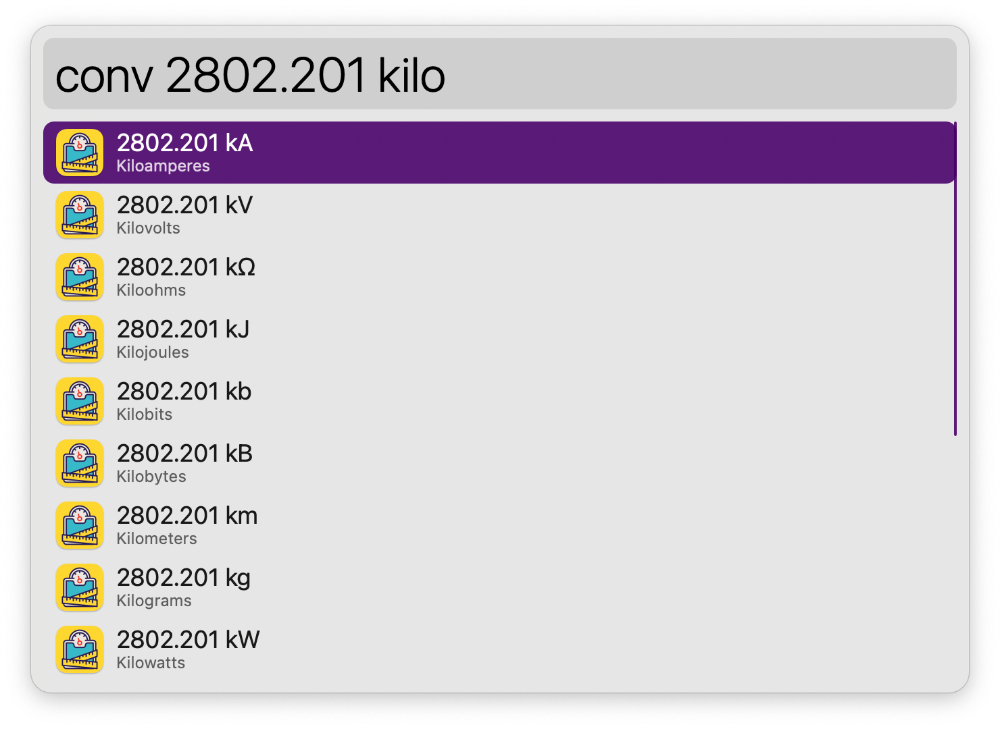
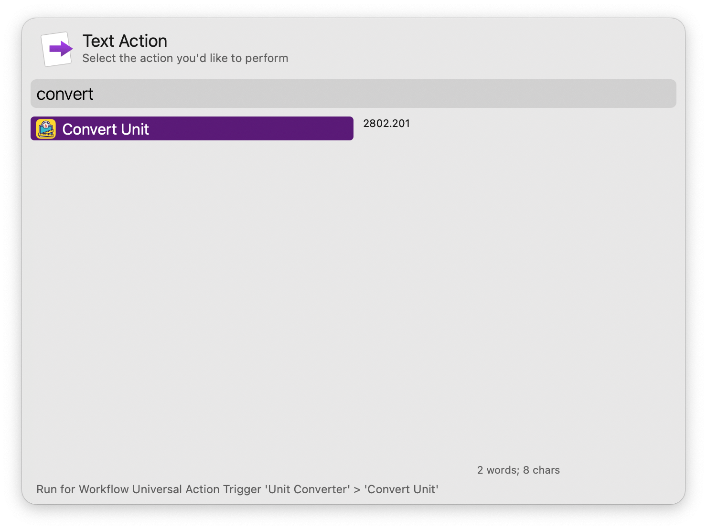

#  Unit Converter Alfred Workflow

Convert between different units of measurement

[⤓ Install on the Alfred Gallery](https://alfred.app/workflows/alfredapp/unit-converter)

## Usage

Convert dimensions via the `conv` keyword. Type a number to see all available units with their full name and symbol.

Type a unit to filter.

Pressing <kbd>↩&#xFE0E;</kbd> on a partial match triggers the autocomplete. See all possible conversion targets when matching a unit exactly.

Type further to filter for target units. Connector words (“to”, “as”, “in”) are optional to help with readability.

* <kbd>↩&#xFE0E;</kbd> Copy result to clipboard.
* <kbd>⌘</kbd><kbd>↩&#xFE0E;</kbd> Paste result to frontmost app.

Rounding precision and output notation can be set in the [Workflow’s Configuration](https://www.alfredapp.com/help/workflows/user-configuration/). Output format follows the Number Style in System Settings → General → Language & Region.

Configure the [Hotkey](https://www.alfredapp.com/help/workflows/triggers/hotkey/) or use the [Universal Action](https://www.alfredapp.com/help/features/universal-actions/) as shortcuts to convert results from Alfred’s [Calculator](https://www.alfredapp.com/help/features/calculator/), [Clipboard History](https://www.alfredapp.com/help/features/clipboard/), or selected text.

